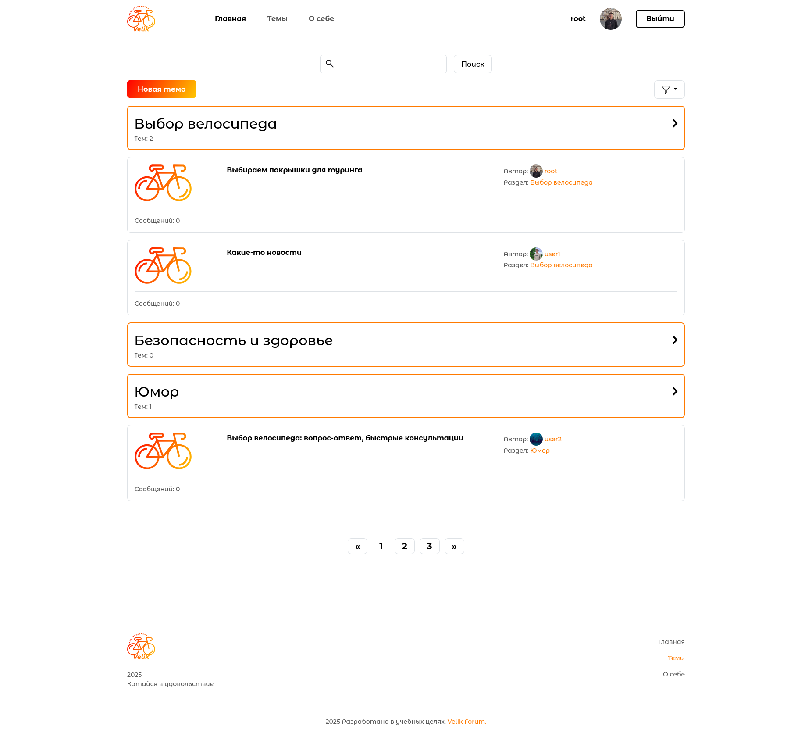
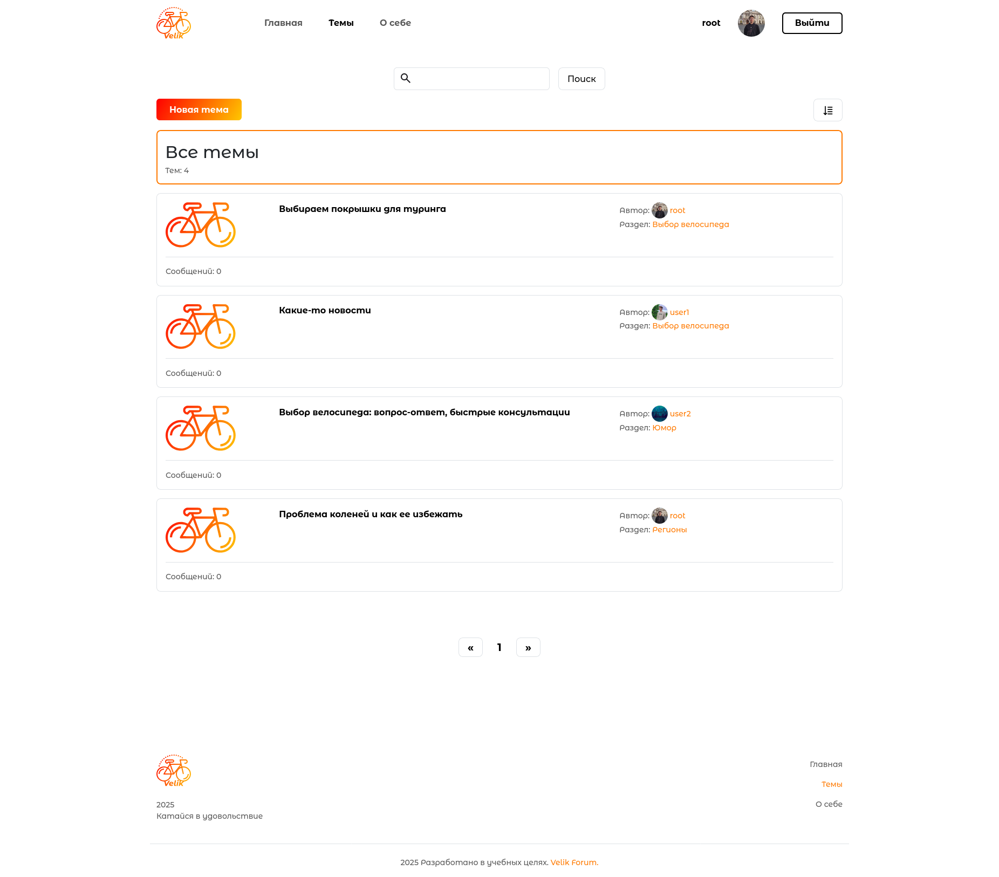
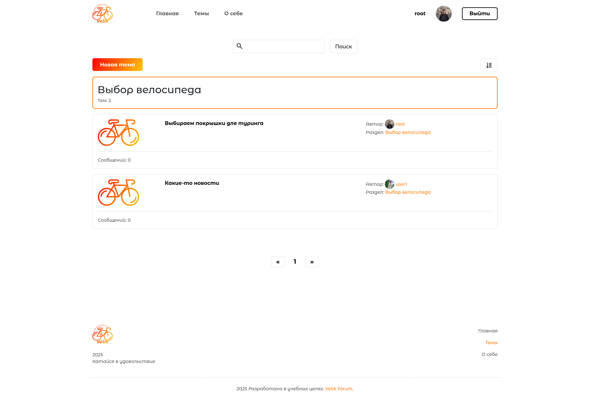
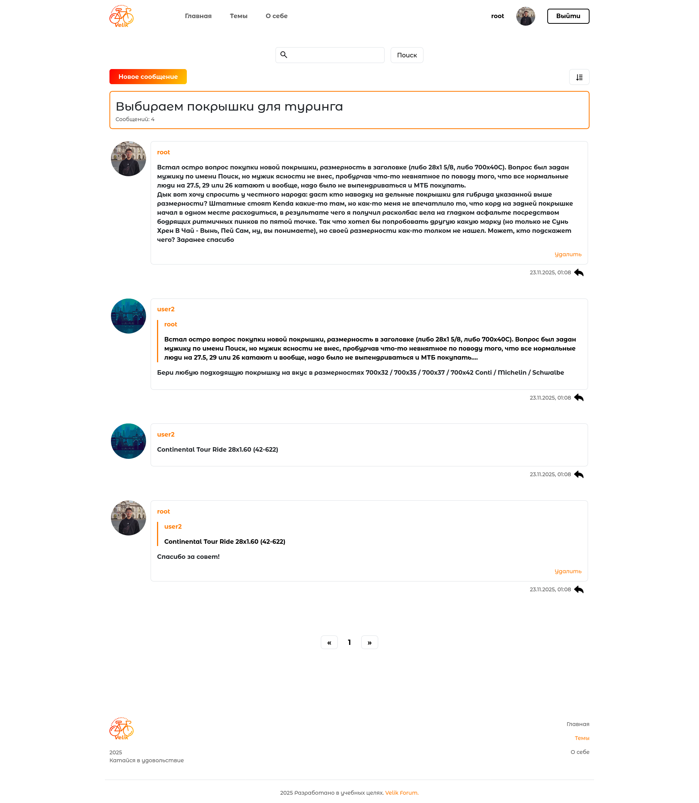
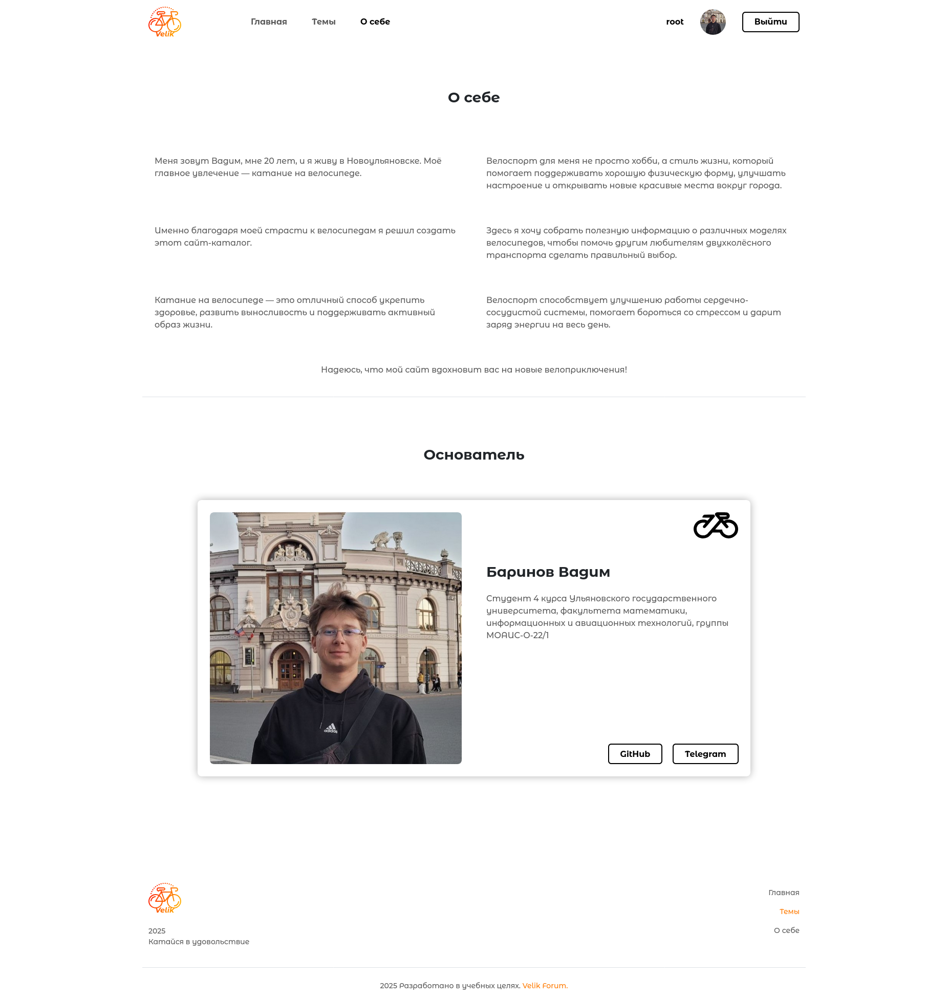
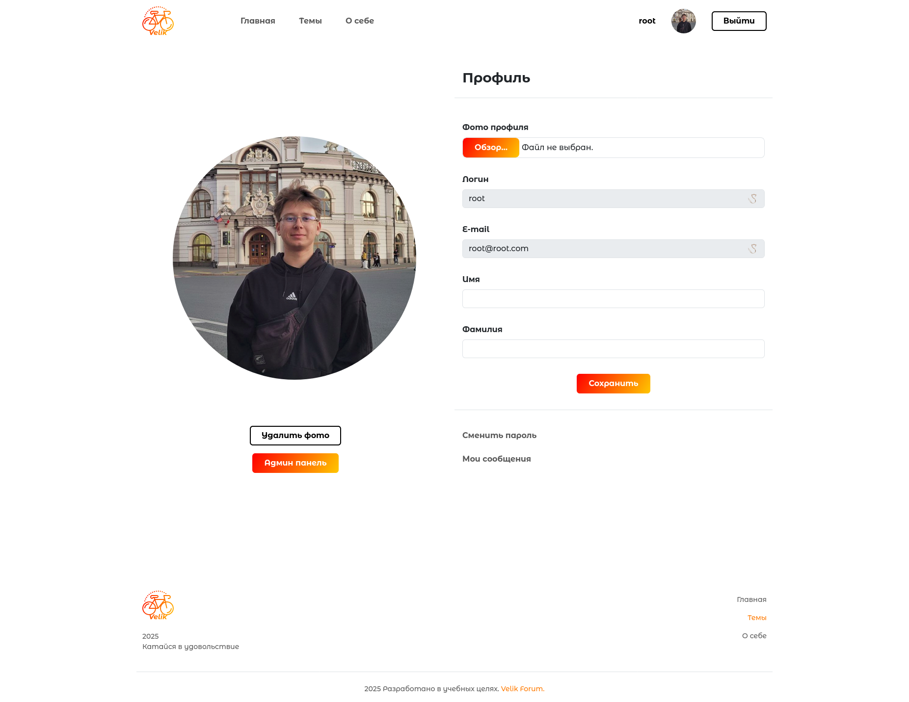
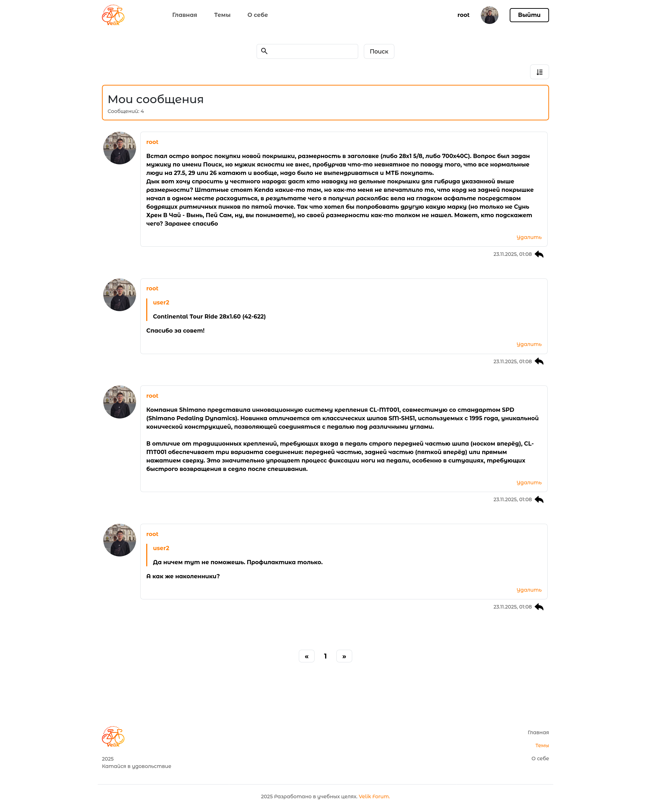
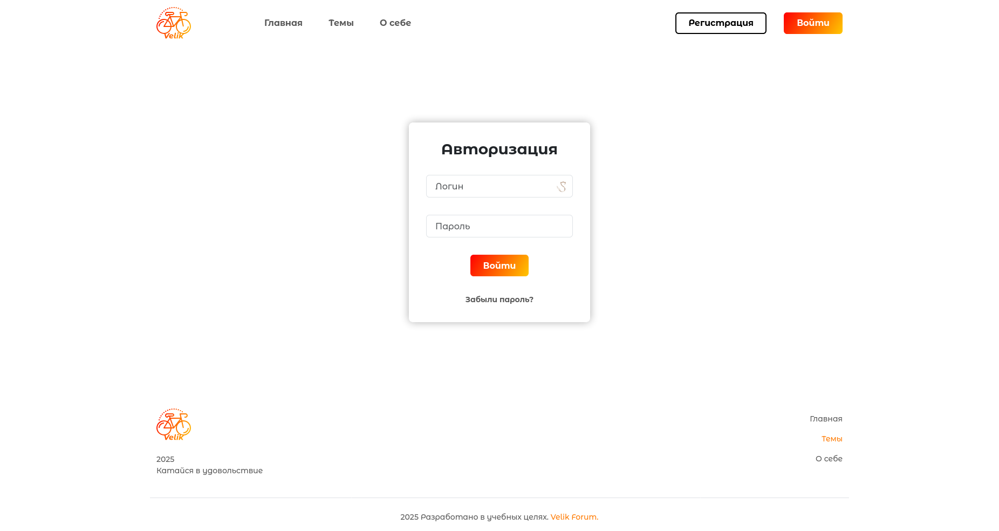
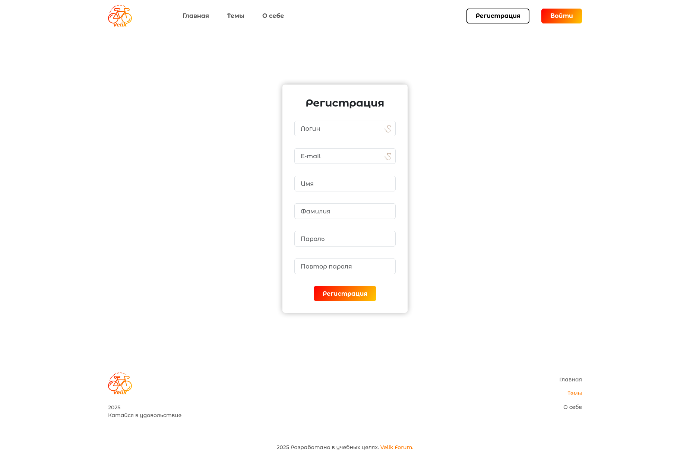

# Велофорум

#### Проект:

1. Форум написан с использованием фреймворка _Django_
2. Используется _PostgreSQL_

Проект запускается с помощью _Docker Compose_

---

## Запуск проекта

#### Для успешной работы проекта необходимо выполнить следующие шаги:

1. Установить _Docker_ на свой компьютер, если он еще не установлен: [_Get Started with Docker_](https://www.docker.com/get-started)

2. Склонировать данный репозиторий

```bash
git clone https://github.com/VadimBarinov/Bicycle-Forum.git
```

3. Перейти в директорию с проектом

```bash
cd Bicycle-Forum
```

4. *Для правильной работы _SMTP_ необходимо ввести свои данные в .env(.env/template)
```
...
SMTP__EMAIL_HOST = "host"
SMTP__EMAIL_PORT = "port"
SMTP__EMAIL_HOST_USER = "email"
SMTP__EMAIL_HOST_PASSWORD = "password"
SMTP__EMAIL_USE_SSL = "1"
...
```

5. Запустить приложение

```bash
docker-compose up
```

6. Выполнить миграции

```bash
docker-compose exec web python manage.py migrate
```

7. Добавить тестовые данные

```bash
docker-compose exec web python init_db.py
```

---

## Доступ к админ панели

#### Для доступа к _Admin_ панели необходимо использовать следующие параметры:

- Username : root
- Email : root@root.com
- Password : root

---

## Подключение к проекту

После выполнения подготовительных действий проект будет доступен по адресу

```bash
    http://localhost:80/
```

---

# Форум

## Главная
- Выводятся темы по разделам
- На каждой странице по 3 раздела с темами
- Можно перейти на страницу создания новой темы
- Можно перейти к конкретному разделу с темами
- Есть возможность поиска по темам
- Есть фильтр по разделам



## Все темы
- Выводятся все темы
- На каждой странице по 10 тем
- Можно перейти к созданию новой темы
- Можно перейти к конкретной теме
- Есть возможность поиска
- Есть возможность сортировки по возрастанию/убыванию



## Раздел
- Выводятся все темы выбранного раздела
- На каждой странице по 10 тем
- Можно перейти к созданию новой темы в выбранном разделе
- Можно перейти к конкретной теме
- Есть возможность поиска
- Есть возможность сортировки по возрастанию/убыванию



## Выбранная тема
- Выводятся все сообщения по выбранной теме
- На каждой странице по 10 сообщений
- Можно перейти к созданию нового сообщения
- Можно ответить на выбранное сообщение
- Если пользователь является автором, то он может удалить сообщение
- Есть возможность поиска
- Есть возможность сортировки по возрастанию/убыванию



## О себе



## Профиль пользователя
- Можно отредактировать данные пользователя:
  - Логин
  - E-mail
  - Имя
  - Фамилия
  - Фото профиля
- Есть возможность смены пароля
- Можно удалить фото профиля
- Можно посмотреть свои сообщения
- Если пользователь имеет права администратора, то он может перейти в админ панель 



## Мои сообщения
- Выводятся все сообщения пользователя
- Можно удалить выбранное сообщение
- Можно перейти к выбранному сообщению
- Можно ответить на выбранное сообщение
- Есть возможность поиска
- Есть возможность сортировки по возрастанию/убыванию




## Форма входа
- Вводятся логин и пароль пользователя
- Есть возможность восстановления пароля:
  - На введенную почту приходит письмо с одноразовой ссылкой для изменения пароля



## Форма регистрации
- Обязательные поля:
  - Логин
  - E-mail
  - Пароль
  - Повтор пароля
- Необязательные поля:
  - Имя 
  - Фамилия


